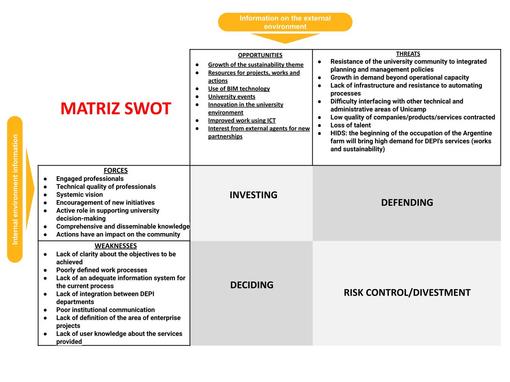

# swot-matrix-group-decision
Selecting and ordering elements of the swot matrix through a multicriteria and group decision-making approach


## Contents
- [Requirements](#Requirements)     
- [Analysis](#Analysis)
- [Solutions](#Solutions)
- [References](#References)

## Requirements

```bash
python pip install -r requirements.txt
```

## Analysis

## Solutions



## References

[1] Alptekín, N. (2013) Integration of SWOT Analysis and TOPSIS Method In Strategic Decision
Making Process. Anadolu University Faculty of Business Administration, Turkey.

[2] Atvars, T. D. Z; Serafim, M. (2020) Gestão estratégica Planes: planejamento estratégico –
Universidade Estadual de Campinas – UNICAMP 2021-2025 - Campinas, SP: UNICAMP/CGU;
BCCL, 2020.

[3] Ishizaka, A.; Nemery, P. (2013) Multi-Criteria Decision Analysis: Methods and Software. 1° Ed.
John Wiley & Sons, Ltd: New Delhi, India.

[4] Kangas, J. ; Pesonen, M.; Kurttila, M.; Kajanus, M., (2001) A'WOT: INTEGRATING THE AHP
WITH SWOT ANALYSIS. Finnish Forest Research Institute Kannus Research Station.

[5] Toni, J. (2021) Reflexões sobre o Planejamento Estratégico no Setor Público / Jackson de Toni. –
Brasília: Enap.

[6] Živkovic’, Z.; Nikoli’c, D.; Savic’, M; Djordjevic’, P.; Mihajlovic’, I. (2017) Prioritizing
Strategic Goals in Higher Education Organizations by Using a
SWOT–PROMETHEE/GAIA–GDSS Model. Engineering Management Department, University
of Belgrade, Technical Faculty in Bor - DOI: 10.1007/s10726-017-9533-y